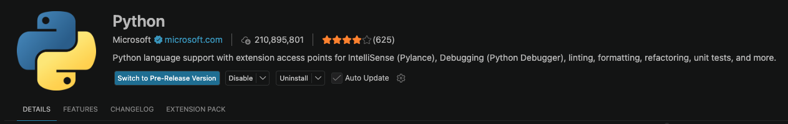
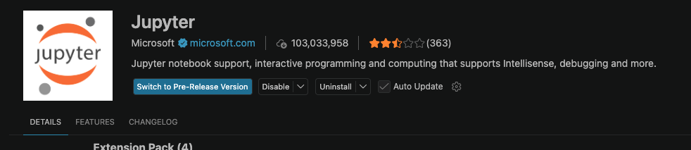
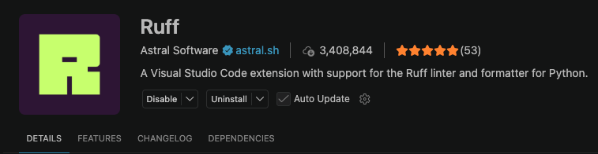
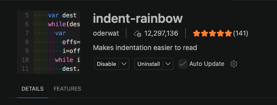
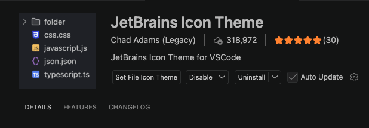

# 환경 설정
## Visual Studio Code
### 확장 프로그램
#### 필수



#### 선택
##### 들여쓰기를 색깍로 구분 가능해 들여쓰기가 맞는지 확인하기 용이

##### 아이콘 이쁘게 하고 싶으면 설치


## 파이썬 가상환경 설치
```py
uv venv
.venv/Script/activate
```

## 패키지 설치
```
uv sync
```